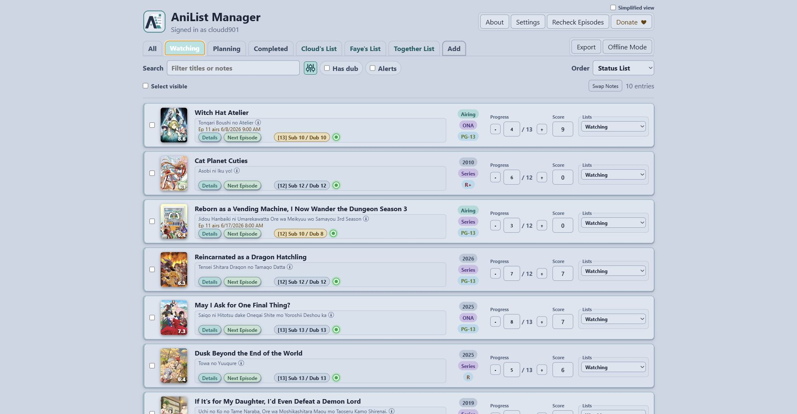
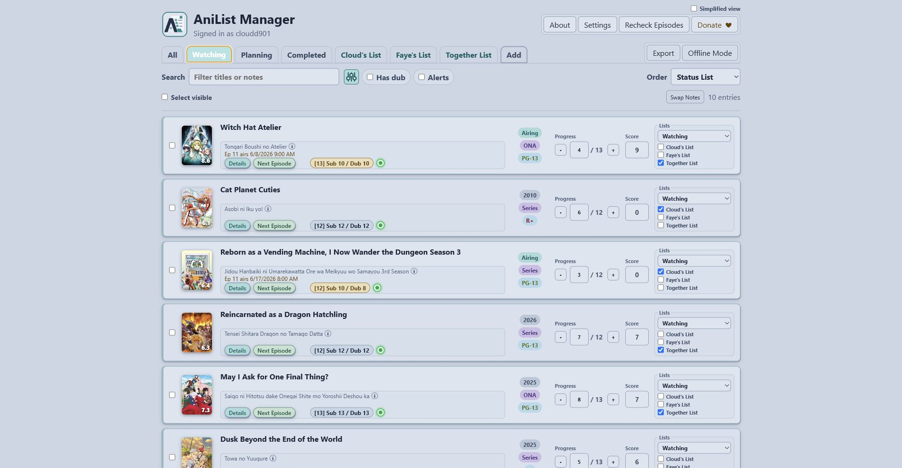
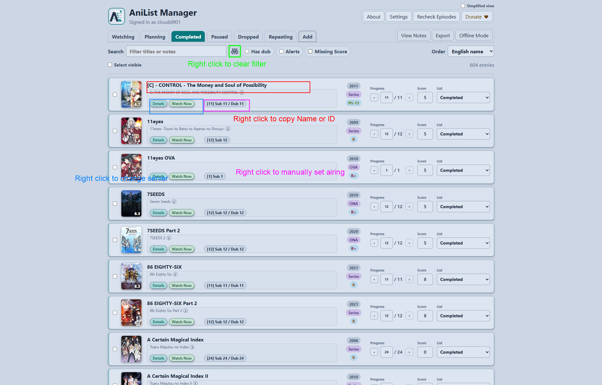
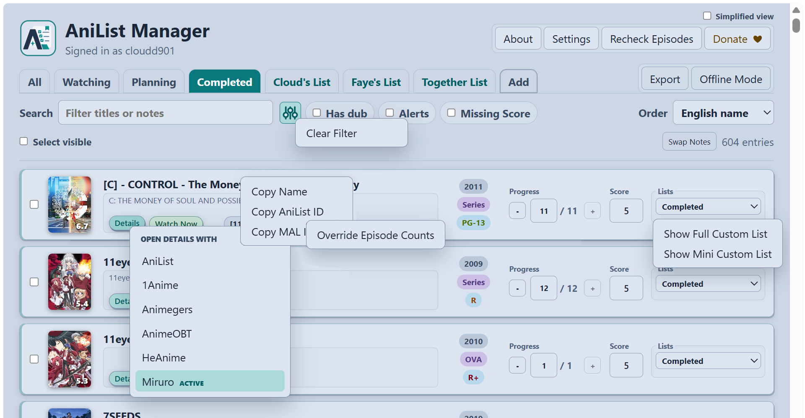
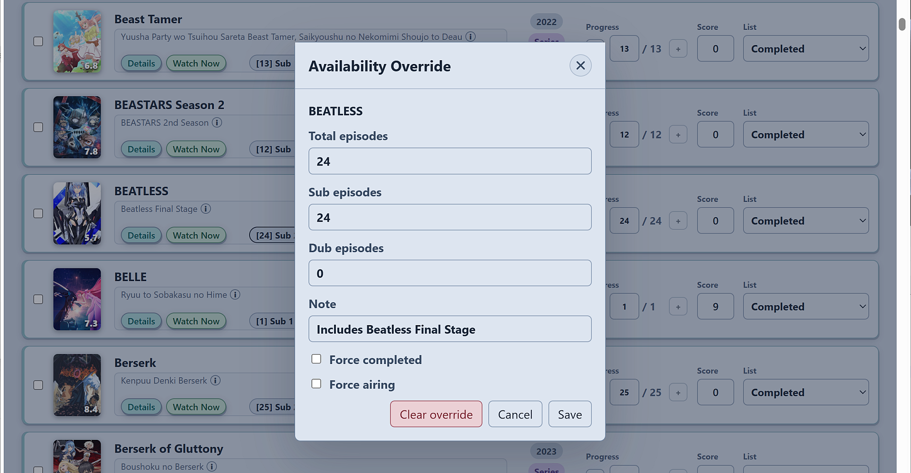
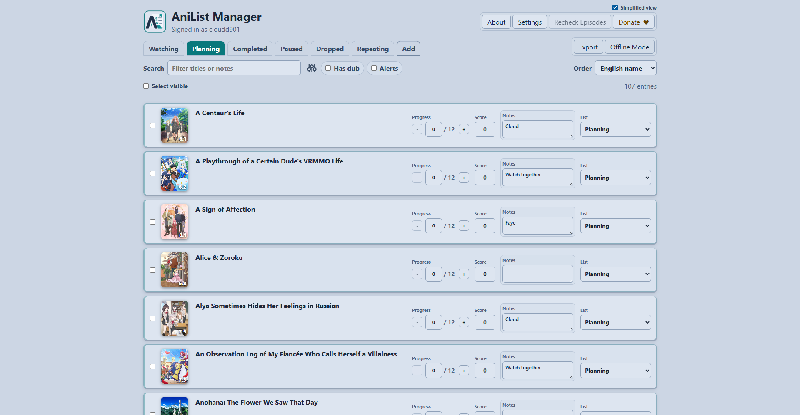
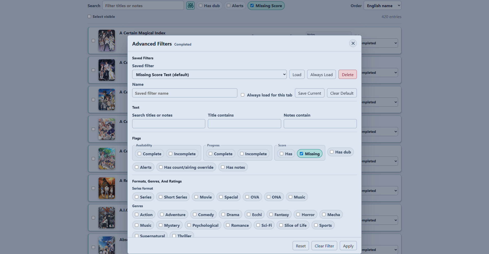

# AniList Manager Portable

AniList Manager Portable is a local Windows app for reading and managing an AniList anime list from a browser UI. The executable starts a local server, opens a tray icon, and serves the app at:

`http://localhost:6767`

The release is portable. Unzip it, run `AniListManagerPortable.exe`, and keep the executable with its `data` folder if you move it to another location.

## Screenshots

### List Management

### Notes And Availability

### Hidden Right-Click Actions

### Simplified View

### Advanced Filters

### Add Anime Search

### Settings

### About

## First Run

1. Run `AniListManagerPortable.exe`.
2. Open the page from the tray menu if the browser does not open automatically.
3. Open `Settings`.
4. Save an AniList token or import one from `anilist-cli` if a CLI token is already available.

The app stores user data beside the executable. Do not share the `data` folder if it contains your token.

## Features

### Main Features

- Browse, search, filter, and sort AniList anime lists.
- Manage status lists and custom lists as tabs.
- Create and delete AniList custom lists from Settings.
- Add or remove entries from custom lists from each row or with bulk actions.
- Update watched progress, AniList score, notes, and list status.
- Add new anime from AniList search.
- Use Simplified view for a cleaner editing layout.

### Additional Features

- Advanced Filters cover text, status lists, custom lists, availability, progress, score, format, genre, rating, numeric ranges, and saved per-tab presets.
- Bulk actions can update progress, status, custom lists, local notes, and deletion for selected rows.
- Sub/Dub availability badges show total, subbed, and dubbed episode counts when lookup data is available.
- Availability rechecks can target all rows, missing rows, or airing rows, with reusable cache entries, visible progress, and cancellation.
- Right-click availability badges to manage local episode-count overrides.
- Local notes mode can keep notes in the portable folder without writing them to AniList.
- Watch Now links can open configured detail and next-episode URLs.
- Cover previews show artwork, synopsis, and genres on hover, keyboard focus, or click.
- Offline Mode packages lists and cover images locally, queues edits, then syncs or discards queued edits when returning online.
- Export filtered rows or all lists as CSV or MyAnimeList import XML.
- About and Settings can check GitHub releases and show update details.
- Large lists load in chunks and show local, remote, cache, and entry-count diagnostics.

## Tray App

The tray app owns the local server.

- `Open` opens the browser UI.
- `Start Server` and `Stop Server` control the internal local server.
- `Refresh Status` updates tray status.
- `Exit` stops the server and closes the tray app.

The app listens only on local loopback URLs:

- `http://127.0.0.1:6767`
- `http://localhost:6767`

## Authentication

AniList list reads and list changes require an AniList token. In `Settings > Authentication`:

- Use `Login to AniList` before creating a token if needed.
- Use the AniList developer page and authorization helper to create a token.
- Paste the token into `New AniList token` and save it.
- Use logout to remove the token saved in portable config.

Token lookup order:

1. `ANILIST_TOKEN` or `ANILIST_ACCESS_TOKEN` environment variable.
2. Portable `data\config.json`.

An existing `~\.config\anilist-cli\config.json` token can be imported, but `anilist-cli` is not required to run the portable release.

## Local Data

Portable data is stored beside the executable:

- `data\config.json`: token, Appearance, update, notes-mode, Simplified view, and saved Advanced Filters settings.
- `data\list-metadata.json`: custom-list tab visibility, order, default tab, and list counts.
- `data\availability-cache.json`: cached sub/dub availability lookups.
- `data\availability-overrides.json`: local manual availability overrides.
- `data\mal-cache.json`: cached MAL/Jikan metadata, totals, and rating labels.
- `data\notes.json`: local per-anime notes.
- `data\watch-now-servers.json`: Watch Now server selection, link toggles, and server URL templates.
- `data\offline\`: packaged Offline Mode lists, cover images, state, and queued edits.

Availability overrides and notes are local to this portable folder. They are not synced to AniList.

## Advanced Filters

Use the sliders button beside the list search box to open Advanced Filters. The dialog can filter by:

- Text across title and notes, title-only text, or notes-only text.
- Status List and Custom List membership.
- Availability completeness, progress completeness, dub availability, unwatched availability alerts, local overrides, notes, and score presence.
- Format, genre, and MAL/Jikan content rating.
- Numeric comparisons for year, public score, episode count, progress, sub episodes, and dub episodes.
- Primary and secondary sort fields with ascending or descending direction.

Saved filters can be loaded later or marked as the default for a status tab. Right-click the sliders button to clear the current filter quickly.

## Availability And Ratings

Availability counts are best-effort metadata. Provider matches can be incomplete or wrong for specials, split seasons, OVAs, and franchise titles with similar names. Use a local availability override when you have a verified correction.

MAL content rating pills such as `PG-13`, `R`, and `R+` are loaded separately from AniList. Successful rating lookups are reused from `data\mal-cache.json` on later loads instead of periodically refetching the rating. Rating lookup failures do not block list loading.

Automatic episode checks load saved counts first, permanently reuse high-confidence completed availability for finished anime, and omit unreleased titles from the provider queue. Provider requests use the direct service first with guarded proxy failover. If the provider is slow, rate limited, or unavailable, the automatic check stops early, keeps saved counts, and remembers deferred titles for a later retry.

`Recheck Episodes` refreshes non-permanent entries and skips cached entries marked as permanent high-confidence matches or local overrides. The refresh dialog can target missing or previously deferred entries, airing or dub-behind-sub entries, or the current target set. Deferred titles persist in the browser until a provider lookup succeeds or a stable local result replaces them. Manual checks remain cancellable and can force selected entries to refresh.

## Watch Now Settings

`Settings > Watch Now` manages the server list used by the `Details` and `Next Episode` links.

Each server stores separate URL templates. Details templates must contain `<anilistid>` or `<malid>`. Watch templates must contain either ID placeholder and `<episode>`. Links that require `<malid>` fall back or stay hidden when the AniList entry has no MAL ID.

Use `Force use AniList for Details links` to send Details directly to AniList. Details also fall back to AniList when there is no active Watch Now server. `Hide Watch Now episode links` hides the `Next Episode` action without hiding Details.

## Offline Mode

Use `Offline Mode` from the main toolbar to package your AniList lists, local metadata, and cover images into `data\offline`. While Offline Mode is active, the app reads from the packaged data and disables network-only actions such as AniList search, token changes, external details links, availability rechecks, and Watch Now links.

Progress, score, status, note, and remove actions made while offline are queued locally. When you turn Offline Mode off, the app can sync queued AniList edits or discard them. You can also choose whether to keep or remove the packaged offline data after disabling Offline Mode.

## Export

Use `Export` from the main toolbar to download either the currently filtered rows or all AniList status lists.

- `Full CSV Export` includes AniList fields, local notes, availability counts, MAL ratings, and Watch Now link metadata when cached.
- `MyAnimeList Import XML` exports list status, progress, score, comments, and MAL IDs for entries that have a MAL mapping.

## Appearance Settings

`Settings > Appearance` applies the app palette immediately and saves it in `data\config.json`.

- Color mode can be Light, Soft, Dim, Dark, or System.
- Accent theme can be Blue, Teal, or Rose.
- Alert icon can be Triangle, Beacon, Bolt, Dot, or Green Dot.
- Synonym subtitles can be shown or hidden.
- The synonym info icon can be shown or hidden.
- Profiles without Appearance settings use Soft + Teal with the Green Dot alert icon until changed.

The main toolbar also includes Simplified view. It hides Watch Now links, metadata pills, and the View Notes toggle, leaving a denser editing layout for progress, score, notes, and list status.

## Update Checks

The app can check GitHub releases for a newer portable ZIP.

- `Settings > Updates` controls the daily automatic update check and can run a manual check.
- `About > Updates` shows the current version, latest release information, release notes, download link, and an ignore action for the currently available update.
- Updates are not installed in place. Download the ZIP, exit the app, and replace `AniListManagerPortable.exe` and `README.md` with the files from the release while keeping your `data` folder.

## External Sites And APIs

The app calls these services directly:

| Site or API | Used for |
| --- | --- |
| `https://graphql.anilist.co` | AniList viewer/auth checks, anime list reads, progress updates, score updates, status moves, bulk AniList changes, and list-entry deletion. |
| `https://allanime-api.shashankbhake.codes` | Primary sub/dub availability search metadata for episode count badges. |
| `https://api.allanime.day/api` | Fallback availability provider lookup when the hosted availability API is unavailable or insufficient. |
| `https://api.jikan.moe/v4/anime/{malId}` | MAL metadata used for corrected finished totals and content rating pills. |
| `https://api.github.com/repos/<owner>/AniList-Manager-Portable/releases/...` | Update checks, current release notes, latest release notes, and portable ZIP download metadata. |

The app opens these AniList web pages from Settings:

| Site | Used for |
| --- | --- |
| `https://anilist.co/login` | Login helper before token creation. |
| `https://anilist.co/settings/developer` | AniList API client setup. |
| `https://anilist.co/api/v2/oauth/authorize?...` | AniList token authorization helper. |

The active Watch Now server is opened by your browser when it supplies the selected `Details` or `Next Episode` URL.

The Donate button opens PayPal in your browser at `https://www.paypal.com/donate/?hosted_button_id=JK8ZEGCDMWP94`.

## Notes

- No Node.js, npm, anilist-cli, or .NET runtime is required for the portable release.
- The local app does not expose your plaintext token to the browser API.
- Availability and MAL/Jikan data are cached locally to reduce repeated external requests.

## Development Build Notes

Development requires Node.js/npm for the React UI and the .NET 9 SDK for the native app.

- Run `npm run build` from `web\` for a quick frontend build check.
- Run `dotnet run --project tests\AniListManagerPortable.Tests.csproj -c Release` for deterministic availability cache-policy tests.
- Run `scripts\rebuild-release-test.ps1` to rebuild `release\AniListManagerPortable` for local release testing without creating a ZIP. It preserves `release\AniListManagerPortable\data` and `.runtime`.
- Run `scripts\build-release.ps1` only when creating a packaged ZIP release.
- Native AOT publishing requires MSVC `link.exe`. If it is unavailable, the release script falls back to a trimmed self-contained single-file executable.
