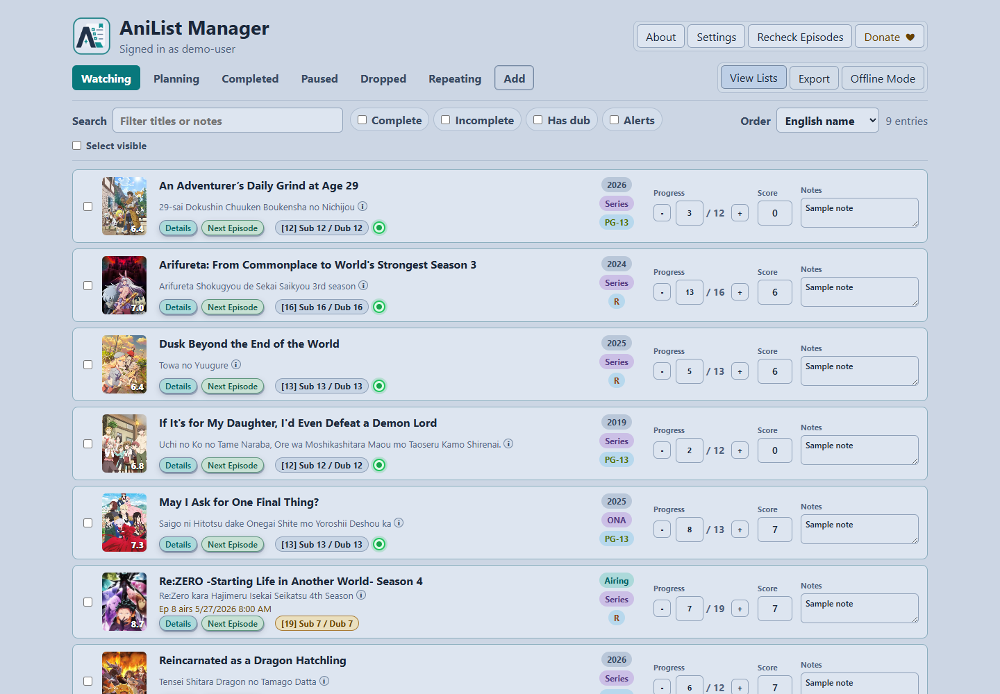
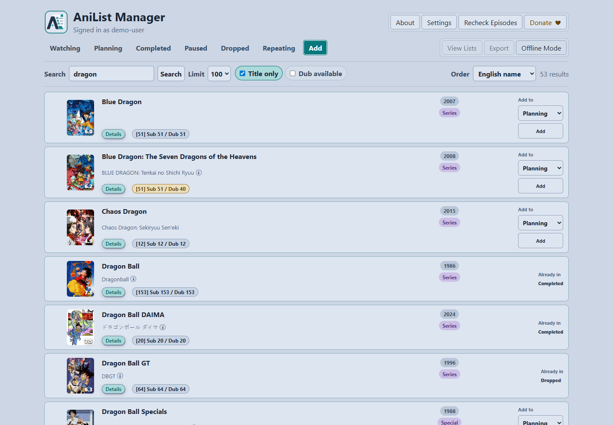
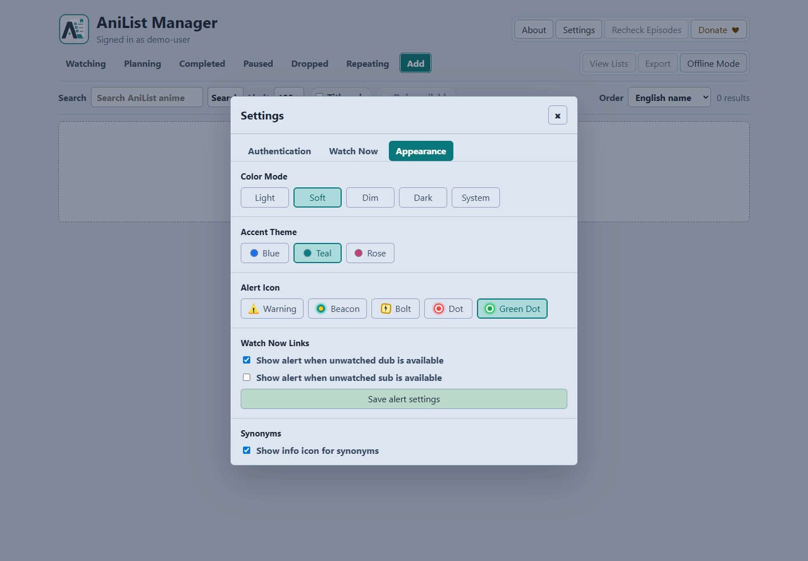
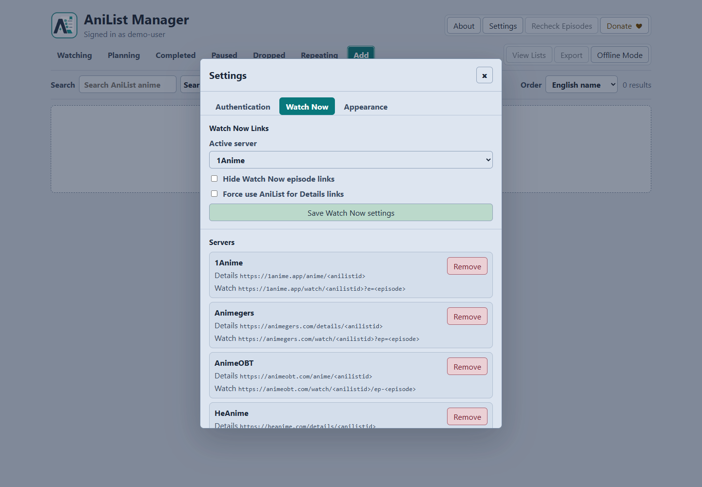
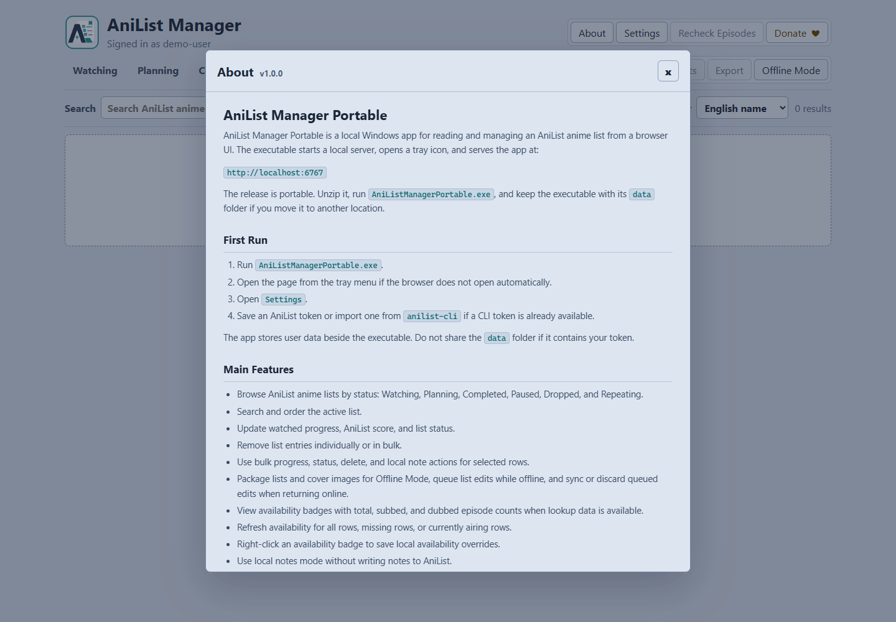

# AniList Manager Portable

AniList Manager Portable is a local Windows app for reading and managing an AniList anime list from a browser UI. The executable starts a local server, opens a tray icon, and serves the app at:

`http://localhost:6767`

The release is portable. Unzip it, run `AniListManagerPortable.exe`, and keep the executable with its `data` folder if you move it to another location.

## Screenshots

### List Management

### Notes And Availability

### Add Anime Search

### Settings

### About

## First Run

1. Run `AniListManagerPortable.exe`.
2. Open the page from the tray menu if the browser does not open automatically.
3. Open `Settings`.
4. Save an AniList token or import one from `anilist-cli` if a CLI token is already available.

The app stores user data beside the executable. Do not share the `data` folder if it contains your token.

## Main Features

- Browse AniList anime lists by status: Watching, Planning, Completed, Paused, Dropped, and Repeating.
- Search and order the active list.
- Update watched progress, AniList score, and list status.
- Remove list entries individually or in bulk.
- Use bulk progress, status, delete, and local note actions for selected rows.
- Package lists and cover images for Offline Mode, queue list edits while offline, and sync or discard queued edits when returning online.
- View availability badges with total, subbed, and dubbed episode counts when lookup data is available.
- Refresh availability for all rows, missing rows, or currently airing rows.
- Right-click an availability badge to save local availability overrides.
- Use local notes mode without writing notes to AniList.
- Open anime detail links through AniList or a configured Watch Now server and open next-episode links when a Watch URL is available.
- Preview a thumbnail cover with the anime synopsis and genres on hover or keyboard focus, or click it to keep one centered preview open.
- Show metadata pills for year or airing state, AniList format, and MAL content rating when available.

## Tray App

The tray app owns the local server.

- `Open` opens the browser UI.
- `Start Server` and `Stop Server` control the internal local server.
- `Refresh Status` updates tray status.
- `Exit` stops the server and closes the tray app.

The app listens only on local loopback URLs:

- `http://127.0.0.1:6767`
- `http://localhost:6767`

## Authentication

AniList list reads and list changes require an AniList token. In `Settings > Authentication`:

- Use `Login to AniList` before creating a token if needed.
- Use the AniList developer page and authorization helper to create a token.
- Paste the token into `New AniList token` and save it.
- Use logout to remove the token saved in portable config.

Token lookup order:

1. `ANILIST_TOKEN` or `ANILIST_ACCESS_TOKEN` environment variable.
2. Portable `data\config.json`.

An existing `~\.config\anilist-cli\config.json` token can be imported, but `anilist-cli` is not required to run the portable release.

## Local Data

Portable data is stored beside the executable:

- `data\config.json`: token and general app settings.
- `data\availability-cache.json`: cached sub/dub availability lookups.
- `data\availability-overrides.json`: local manual availability overrides.
- `data\mal-cache.json`: cached MAL/Jikan metadata, totals, and rating labels.
- `data\notes.json`: local per-anime notes.
- `data\watch-now-servers.json`: Watch Now server selection, link toggles, and server URL templates.
- `data\offline\`: packaged Offline Mode lists, cover images, state, and queued edits.

Availability overrides and notes are local to this portable folder. They are not synced to AniList.

## Availability And Ratings

Availability counts are best-effort metadata. Provider matches can be incomplete or wrong for specials, split seasons, OVAs, and franchise titles with similar names. Use a local availability override when you have a verified correction.

MAL content rating pills such as `PG-13`, `R`, and `R+` are loaded separately from AniList. Successful rating lookups are reused from `data\mal-cache.json` on later loads instead of periodically refetching the rating. Rating lookup failures do not block list loading.

## Watch Now Settings

`Settings > Watch Now` manages the server list used by the `Details` and `Next Episode` links.

Each server stores separate URL templates. Details templates must contain `<anilistid>` or `<malid>`. Watch templates must contain either ID placeholder and `<episode>`. Links that require `<malid>` fall back or stay hidden when the AniList entry has no MAL ID.

Use `Force use AniList for Details links` to send Details directly to AniList. Details also fall back to AniList when there is no active Watch Now server. `Hide Watch Now episode links` hides the `Next Episode` action without hiding Details.

## Offline Mode

Use `Offline Mode` from the main toolbar to package your AniList lists, local metadata, and cover images into `data\offline`. While Offline Mode is active, the app reads from the packaged data and disables network-only actions such as AniList search, token changes, external details links, availability rechecks, and Watch Now links.

Progress, score, status, note, and remove actions made while offline are queued locally. When you turn Offline Mode off, the app can sync queued AniList edits or discard them. You can also choose whether to keep or remove the packaged offline data after disabling Offline Mode.

## Appearance Settings

`Settings > Appearance` applies the app palette immediately and saves it in `data\config.json`.

- Color mode can be Light, Soft, Dim, Dark, or System.
- Accent theme can be Blue, Teal, or Rose.
- Profiles without Appearance settings keep the Light + Blue default until changed.

## External Sites And APIs

The app calls these services directly:

| Site or API | Used for |
| --- | --- |
| `https://graphql.anilist.co` | AniList viewer/auth checks, anime list reads, progress updates, score updates, status moves, bulk AniList changes, and list-entry deletion. |
| `https://allanime-api.shashankbhake.codes` | Primary sub/dub availability search metadata for episode count badges. |
| `https://api.allanime.day/api` | Fallback availability provider lookup when the hosted availability API is unavailable or insufficient. |
| `https://api.jikan.moe/v4/anime/{malId}` | MAL metadata used for corrected finished totals and content rating pills. |

The app opens these AniList web pages from Settings:

| Site | Used for |
| --- | --- |
| `https://anilist.co/login` | Login helper before token creation. |
| `https://anilist.co/settings/developer` | AniList API client setup. |
| `https://anilist.co/api/v2/oauth/authorize?...` | AniList token authorization helper. |

The active Watch Now server is opened by your browser when it supplies the selected `Details` or `Next Episode` URL.

## Notes

- No Node.js, npm, anilist-cli, or .NET runtime is required for the portable release.
- The local app does not expose your plaintext token to the browser API.
- Availability and MAL/Jikan data are cached locally to reduce repeated external requests.
